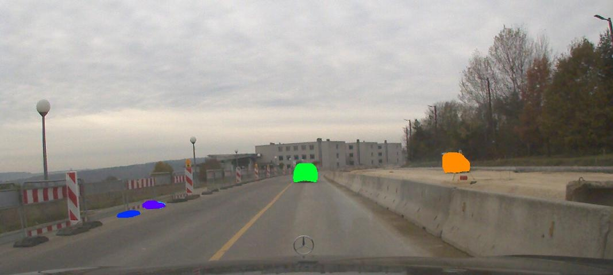
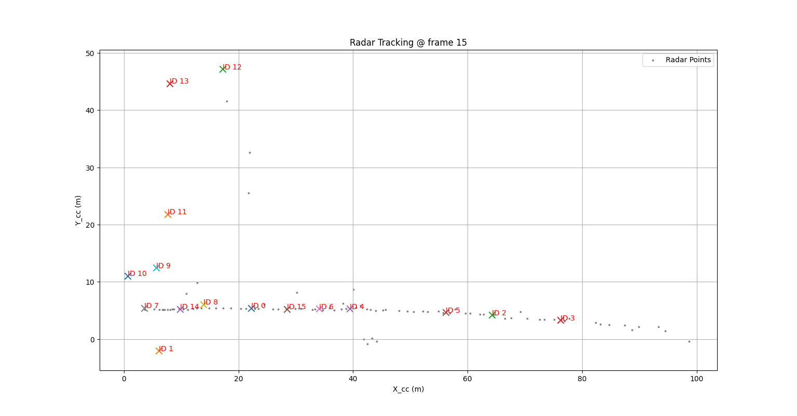
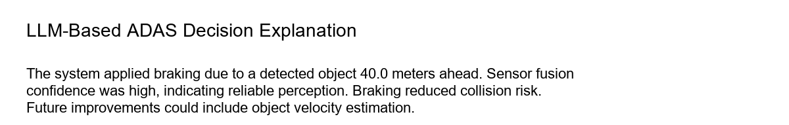

# Smart Multimodal ADAS 🚗📡📷🤖

An end-to-end **Smart Multimodal Advanced Driver Assistance System (ADAS)** prototype combining **Radar**, **Camera**, **Sensor Fusion**, **Tracking**, **Reinforcement Learning–based Decision Making**, and **LLM Explainability**.

This project demonstrates a **research-grade ADAS pipeline** built step-by-step with clean modular design and explainable decisions.

---

## 🚀 Features

- 📡 **Radar Processing**
  - RadarScenes dataset ingestion
  - DBSCAN-based radar point clustering
  - Kalman-filter multi-object tracking

- 📷 **Camera Perception**
  - YOLOv8 object detection
  - GPU-accelerated inference (GTX 1650 Ti supported)

- 🔗 **Sensor Fusion**
  - Temporal alignment (radar ↔ camera)
  - Radar-first spatial association
  - Confidence-based fusion logic

- 🧭 **Multi-Object Tracking**
  - Fused radar–camera tracking
  - Track lifecycle management (creation, update, deletion)

- 🎮 **Decision Making**
  - Custom Gym-based ADAS environment
  - Deep Q-Network (DQN) policy
  - Safety-aware reward shaping

- 🧠 **Explainable AI (XAI)**
  - Decision logging (JSONL)
  - Local LLM (Ollama) explanations
  - Human-readable safety reasoning

---

## 🖼️ Visual Results & Demo

### Camera-Based Object Detection (YOLOv8)
The system detects vehicles and road objects using camera perception.



---

### Radar-Based Tracking
Radar point clustering and Kalman-filter-based tracking of surrounding objects.



---

## 🗂️ Project Structure

```text
smart-multimodal-adas/
│
├── RadarScenes/                # Dataset (external)
│   └── data/
│       └── sequence_1/
│
├── demo/                       # Outputs & trained models
│   ├── camera_radarscenes/
│   └── adas_dqn_model.zip
│
├── logs/
│   └── decision_log.jsonl      # RL decision logs
│
├── src/
│   ├── sensors/
│   │   └── radarscenes_loader.py
│   │
│   ├── perception/
│   │   ├── camera_detect_radarscenes.py
│   │   └── legacy/
│   │
│   ├── fusion/
│   │   ├── fusion_logic.py
│   │   └── legacy/
│   │
│   ├── tracking/
│   │   ├── fused_tracker.py
│   │   ├── run_fused_tracking.py
│   │   └── test_fused_tracking.py
│   │
│   ├── decision/
│   │   ├── adas_env.py
│   │   ├── train_rl_agent.py
│   │   ├── test_rl_agent.py
│   │   ├── decision_logger.py
│   │   └── legacy/
│   │
│   └── llm/
│       └── explain_decision.py
│
└── README.md

```

---

## ⚙️ Environment Setup

### Requirements

* **Python:** 3.10
* **Hardware:** NVIDIA GPU (optional, tested on GTX 1650 Ti)
* **Package Manager:** Conda (recommended)

### 1. Create Conda Environment

```bash
conda create -n smadas python=3.10 -y
conda activate smadas
```

### 2. Install Dependencies

```bash
pip install torch torchvision torchaudio
pip install ultralytics open3d h5py opencv-python matplotlib scikit-learn
pip install gym gymnasium stable-baselines3 shimmy
```

---

## 📊 Dataset

This project uses the **RadarScenes** dataset.

* **Website:** [radar-scenes.com](https://radar-scenes.com/)
* **Kaggle:** [RadarScenes Data Set](https://www.kaggle.com/datasets/aleksandrdubrovin/the-radarscenes-data-set)

> **Note:** After downloading, ensure the following path exists: `RadarScenes/data/sequence_1/`

## ▶️ Execution Order (Important)

Run the scripts in the following order:

### 1️⃣ Radar Processing & Tracking

```bash
python src/sensors/radarscenes_loader.py
```

### 2️⃣ Camera Object Detection

```bash
python src/perception/camera_detect_radarscenes.py
```

### 3️⃣ Temporal Alignment

```bash
python src/fusion/temporal_alignment.py
```

### 4️⃣ Radar–Camera Fusion

```bash
python src/fusion/fusion_logic.py
```

### 5️⃣ Fused Multi-Object Tracking

```bash
python src/tracking/test_fused_tracking.py
```

### 6️⃣ Train RL Decision Agent

```bash
python src/decision/train_rl_agent.py
```

### 7️⃣ Test RL Agent + Log Decisions

```bash
python src/decision/test_rl_agent.py
```

> Logs will be saved to: `logs/decision_log.jsonl`

### 8️⃣ Explain Decisions with LLM

*(Requires Ollama running locally)*

```bash
python src/llm/explain_decision.py
```

---

## 🧠 Example LLM Explanation

```text
 "The vehicle applied braking because the detected object was within a safe stopping distance. Sensor fusion confidence was high, indicating reliable perception. This action reduced collision risk. A future improvement would be incorporating object velocity."
```

## 🧠 Explainable Decision Making (LLM)

Each safety-critical decision made by the RL agent is logged and explained
using a local Large Language Model (LLM).

The explanation includes:
- Why the action was chosen
- Whether it was safe
- Suggestions for improvement



---

## 🧪 Technical Highlights
- DBSCAN clustering on radar point clouds
- Kalman-filter multi-target tracking
- Confidence-based radar–camera fusion
- DQN-based decision policy
- Fully local explainability (no cloud APIs)

---

## 🔮 Future Work
- Proper radar–camera calibration
- Velocity-aware RL state
- BEV visualization
- Multi-sequence training
- Transformer-based sensor fusion
- Formal safety envelopes

---

## 📜 License
This project is intended for research and educational use.

---

## 🙌 Acknowledgements
- RadarScenes Dataset authors
- Ultralytics YOLO
- Stable-Baselines3
- OpenAI Gym / Gymnasium
- Ollama
- 
---
